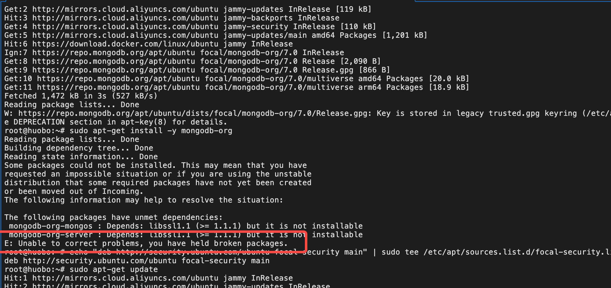

## ubantu 安装 docker
 - https://developer.aliyun.com/article/1210972?spm=5176.21213303.J_qCOwPWspKEuWcmp8qiZNQ.7.2bed2f3dXGDk2I&scm=20140722.S_community@@%E6%96%87%E7%AB%A0@@1210972._.ID_community@@%E6%96%87%E7%AB%A0@@1210972-RL_unbantu%20%E5%AE%89%E8%A3%85docker-LOC_llm-OR_ser-V_3-RK_rerank-P0_1


## unbantu 安装 nginx

 - sudo apt update  更新系统
 - sudo apt install nginx 安装
 - sudo systemctl status nginx 查看nginx 状态
 - sudo systemctl nginx start 启动 nginx
 - sudo systemctl nginx stop 停止 nginx
 - nginx -t 如果有修改可查看 修改是否成功
 - nginx -s reload 重新启动

## nginx 配置信息


## mac 安装 mongoDB 社区版本
  - mongodb 不在开源 无法 通过brew install mongodb
  - brew tap mongodb/brew 安装之前 设定到MongoDB第三方库
  - brew install mongodb-community 安装社区最新版本
  - brew services start mongodb-community 启动
  - mongod --version 查看版本
  - mongosh + 数据库内置函数db.version() 查看版本信息
  > 查看数据库
   - show dbs
  > 切换数据库
   - use Demo
  > 创建表
   - db.user.insert({ userId: 10001 })
  > 查看表
   - db.user.find()
  > 操作命令
  https://blog.csdn.net/Tw_light/article/details/110753675
  https://blog.csdn.net/qq_21460229/article/details/70935170
  https://www.cnblogs.com/my-blogs-for-everone/articles/9749842.html

  - 插入数据
  ```javascript
    var mongoose = require('mongoose');
    mongoose.connect('mongodb://localhost/test');

    var Schema = mongoose.Schema;
    var UserSchema = new Schema({
      name : String,
      age  : Number,
      email: String
    });

    var User = mongoose.model('User', UserSchema);
    // 插入
    var user = new User({ name: 'John', age: 30, email: 'john@example.com' });
    // 保存 
    user.save(callback)

    // 防止重复添加数据
    var UserSchema = new Schema({
        name : { 
          type: String,
          unique: true  // 唯一
          },
        age  : Number,
        email: String
      })
      > 请注意，当你第一次设置unique: true时，MongoDB需要时间来构建唯一索引，所以你可能需要重启你的应用或者手动在MongoDB shell中构建索引。
      // 插入数据是去重
      User.findOneAndUpdate(
        { name: userData.name }, // 查找条件
        userData, // 要插入或更新的数据
        { upsert: true, new: true, runValidators: true }, // 选项
        function (err, doc) { // 回调函数
          if (err) {
            console.log("Something wrong when updating data!");
          }
          console.log(doc);
        }
      );
      // 删除集合
      mongoose.connection.collections['users'].drop(function(err) {
        console.log('collection dropped');
      });

      // 删除数据
      User.remove({ name: 'John' }, function(err) {
        if (err) return handleError(err);
        // removed!
      });
      // 删除特定
      User.findOne({ name: 'John' }, function(err, user) {
        if (err) return handleError(err);
        
        user.remove(function(err) {
          if (err) return handleError(err);
          // removed!
        });
      });
      // 匹配到删除
      User.findOneAndRemove({ name: 'John' }, function(err) {
        if (err) return handleError(err);
        // removed!
      });
      // 指定ID 删除
      User.findByIdAndRemove('5e135963853a3d2b8c759f3b', function(err) {
        if (err) return handleError(err);
        // removed!
      });

  ```

## ubantu 安装 docker 
  - 更新软件包
    `sudo apt-get update`
  - 安装 必要包
    `sudo apt-get install  apt-transport-https ca-certificates curl gnupg lsb-releas`
  - 添加Docker的官方GPG密钥
    `curl -fsSL https://download.docker.com/linux/ubuntu/gpg | sudo gpg --dearmor -o /usr/share/keyrings/docker-archive-keyring.gpg`
  - 使用以下命令设置稳定的仓库：
    `echo "deb [arch=amd64 signed-by=/usr/share/keyrings/docker-archive-keyring.gpg] https://download.docker.com/linux/ubuntu  $(lsb_release -cs) stable" | sudo tee /etc/apt/sources.list.d/docker.list > /dev/null`
  - 更新apt软件包索引，并安装最新版本的Docker Engine和containerd
    `sudo apt-get update`
    `sudo apt-get install docker-ce docker-ce-cli containerd.io`
  - 验证Docker是否安装成功：
    `sudo docker run hello-world`

## docker 安装 jenkins
  - 拉取镜像 最新版本
    `docker pull jenkins/jenkins:lts`
  - 运行容器  将jenkins 运行在 8080 端口 将jenkins 数据存储在主机的jenkins目录下
    `docker run -d -p 8080:8080 -p 50000:50000 -v /jenkins:/var/jenkins_home --name jenkins jenkins/jenkins:lts`
    or
    `docker run -p 8080:8088 -p 50000:50000 jenkins/jenkins`
  - 获取初始管理员密码
    `docker exec jenkins cat /var/jenkins_home/secrets/initialAdminPassword`


## ubantu 安装 nginx
  - sudo apt-get update
  - sudo apt-get install nginx
  - systemctl status nginx
  > 如果你的防火墙正在运行，并且阻止了HTTP和HTTPS访问，你需要配置防火墙以允许这些访问。你可以使用以下命令来允许Nginx的HTTP和HTTPS流量：
  - sudo ufw allow 'Nginx Full'

## ubantu 安装 git

  - sudo apt update
  - sudo apt install git

## ubantu 终端 美化
  - sudo apt install zsh
  - sudo apt install curl
  - sudo apt install wget
  > curl安装
  - sh -c "$(curl -fsSL https://raw.github.com/ohmyzsh/ohmyzsh/master/tools/install.sh)" 
  > wget安装
  - sh -c "$(wget https://raw.github.com/ohmyzsh/ohmyzsh/master/tools/install.sh -O -)"
  > 默认设置
  - chsh -s $(which zsh)


## ubantu 安装 mongodb
  https://pgp.mongodb.com/
  > 导入MongoDB的公共GPG Key。MongoDB的包是通过HTTPS传输的，因此我们需要导入他们的公共GPG Key：
  - wget -qO - https://www.mongodb.org/static/pgp/server-4.4.asc | sudo apt-key add -
  > 创建列表文件
  - echo "deb [ arch=amd64,arm64 ] https://repo.mongodb.org/apt/ubuntu focal/mongodb-org/4.4 multiverse" | sudo tee /etc/apt/sources.list.d/mongodb-org-4.4.list
  > 更新本地包
  - sudo apt-get update
  > 安装mongodb
  - sudo apt-get install -y mongodb-org

  
  - echo "deb http://security.ubuntu.com/ubuntu focal-security main" | sudo tee /etc/apt/sources.list.d/focal-security.list
  - sudo apt-get update
  - sudo apt-get install libssl1.1

  > 启动服务
  - sudo systemctl start mongod
  > 停止服务
  - 
  > 启动时自动启动
  - sudo systemctl enable mongod

## ubantu 安装 最新稳定版 nodejs
 > 下载并运行NodeSource安装脚本
 - curl -sL https://deb.nodesource.com/setup_14.x | sudo -E bash -
 > 安装nodejs
 - sudo apt-get install -y nodejs


## mongodb API
  > 切换数据库
  - use db_name
  > 删除数据库
  - db.dropDatabase()
  > 查看所有数据库
  - show dbs / databases
  > 查看数据库版本
  - db.version()
  > 集合操作
   > 创建集合
   - db.createCollection(name, options)
   > 删除集合
   - db.collection_name.drop()
   > 查看所有集合
   - show collections
    > 集合添加操作
    - db.collection.insert({"name": "mumu"});
    insert{} / insertOne{} / insertMany []
    > 集合查找操作
    - db.collection.find() 
      - sort() -1 / 1 降 / 升
    find / find({}) / 
    > 产查询分页
    - db.user.find().skip(0).limit(3)
    skip() 跳过 / limit() 可单独使用
    > 集合更新操作
    -  db.collection.updateOne({_id: ObjectId("6526ffd80353355e5a66f7ab")}, {$set: { name: "heyunlin" }})
    updateOne / update / updateMany / replaceOne
    > 集合删除操作
    - db.collection.delete({name: "张三"})
    delete / deleteMany / 
    https://blog.csdn.net/heyl163_/article/details/133781878

    > 集合数据数量
    db.collection.count()
    - 推荐
    db.collection.countDocuments()
    db.collection.estimatedDocumentCount
